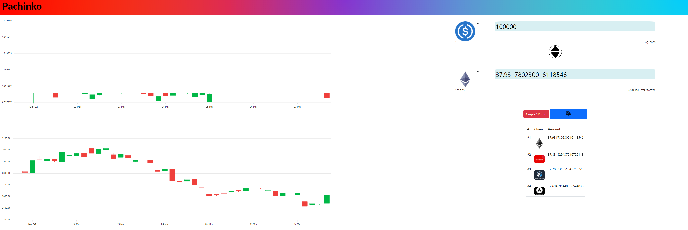
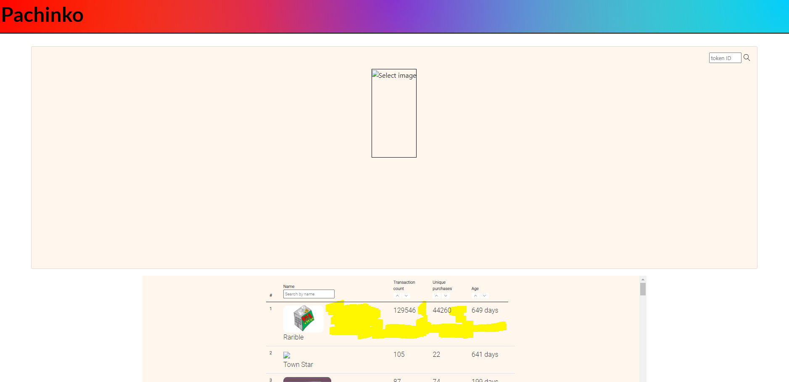

# Documentation

# Purpose
This project serves 2 purpose - it is a cryptocurrecny price aggregator and NFT analysis tool.

Project's name is Pachinko which is a Japanese form of pinball. The pinball is similar to this project,  you wage your money and hope that the pinball hits as many points before it comes back to you : the point is a metaphor for another cryptocurrnecy that you are trying to swap.

There is many different blockchain that is built ontop of Ethereum's virtual machine's code, trading liquidity is spread across different blockchain. The price aggregator tackle this issue directly by displaying the best blockchain to swap your cryptocurrency.
The NFT (Non-fungible token) dashboard has 2 features. First, there is a table where it displays NFT projects and it's stats. Second, it allows users to look up the project's stats on opensea and search for any particular asset (with the token ID ).

As an avid user of cryptocurrency products, I feel that this crypto space can feel like a dark forest. Decentralized financial products on the blockchain can be intimidating to use, the purpose of this project is to help new users onboard and simplify the process of learning. 

There are many smart contract blockchain that is built ontop of EVM (Ethereum virtual machine). The assets on different blockchain can be transfer to and fro each other. There is many different trading platform on different blockchain, Pachinko finds the best blockchain to swap assets on.
There is a recent trend of trading art pieces on the blockchain - NFT(Non-fungible token). There isn't an easy way to do a lookup of the NFT based on it's token ID. Pachinko serves as an easy way to do a look up on ID and show the trade stats of the token on opensea.

## User's story

Acceptance criteria
User story |Acceptance|
--- | --- | 
 A middle aged man who wants to invest his money on NFT art pieces. | Analyse the collection trading data |
Mid 20s young adult that is trying to swap his cryptocurrency for another cryptocurrency    |    Must be able to display the best route possible|
Investment firms that is trying to analyse the routes that pachinko uses to swap the token | Must be able to display all routes in a visual manner |
|| 

## User goals
User's purpose of using the website is to be more informed behind their trading decision, analyse the cryptocurrency market before trading.
Include a URL to the deployed version of your project 

## Font Palette

The following choices of font were made. 

Font family: `'Roboto', sans-serif;`

# Website is live at https://cranky-hermann-6c6365.netlify.app/

# TESTING

## Testcases for routing

# 1 | #2 | #3  | #4 
---| --- | --| --|
Select a token from the list| Enter any amount inside| Enter token that do not share a common platform. i.e. BNB and Ethereum | Click on the middle button that has both up arrow and bottom arrow
|
Chart should change immediately| Click on Graph / Route button (Red button) and it will display the route it take. You can verify this on https://app.1inch.io/#/1/classic/swap/ETH/DAI. Top right hand corner allows user to change the chain. It will display the route it takes | Nothing will display because there is no route | It will reverse the tokens 

## Testcases for NFT dashboard
# #1 |#2 |
--| --|
Hover along the yellow zone of the NFT | After selecting the collection, perform a look up (Some collection do not have tokenID) Sellect BoredApeYatchClub for testing| --| --| 
It will automatically select the Collection and update the card | It will perform a look up with token ID.https://opensea.io/assets/0xbc4ca0eda7647a8ab7c2061c2e118a18a936f13d/%3CtokenID%3E | 

# API
Coingecko : https://api.coingecko.com/api/v3/ 
1inch API : https://api.1inch.io/v4.0/
Covalent API : https://api.covalenthq.com/v1/ 
Opensea API : https://api.opensea.io/api/v1/ 

# CREDITS AND ACKNOWLEDGMENT
- Visual Studio Code
- Git
- GitHub
- Netlify
- HTML5
- CSS3
- JavaScript
- Bootstrap v5.1
- Font Awesome
- Google Fonts
- Apex Charts
- Axios

